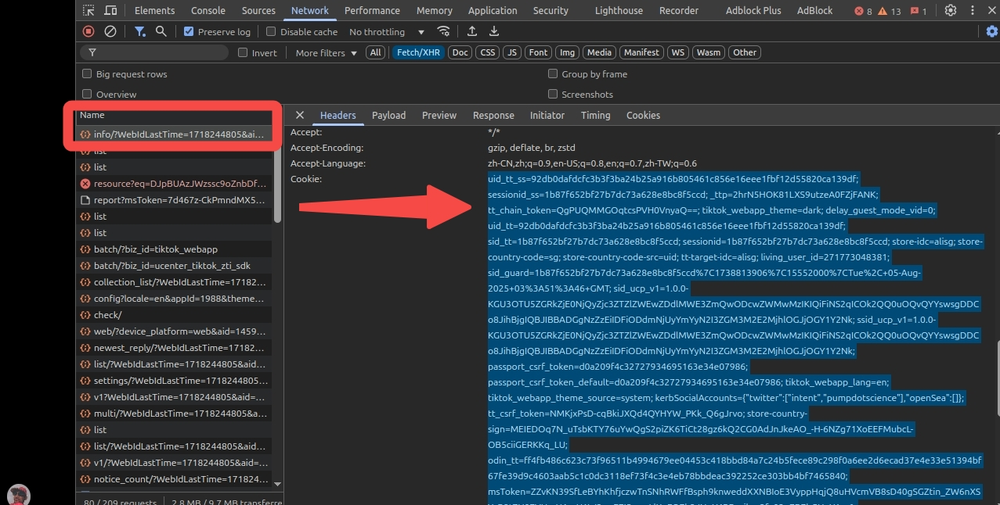

# 爬虫 video crawler
- 下载 Tiktok, 9GAG.com, Reddit 的视频/图片/文案:
  - Tiktok爬虫: [titok_downloader.py](./tiktok_downloader.py)
  - 9gag爬虫: [9gag_downloader.py](./9gag_downloader.py)
  - reddit爬虫: [reddit_downloader.py](./reddit_downloader.py)

## 依赖 Dependencies

- Python版本 :  Python3.13.2 及以上

```

sudo apt install libjpeg-dev zlib1g-dev

pip3 install -r requirements.txt

```

- 下载 Chrome 和 chromedriver (版本必须一致):
  - https://googlechromelabs.github.io/chrome-for-testing/
  - chrome-linux64: https://storage.googleapis.com/chrome-for-testing-public/134.0.6998.165/linux64/chrome-linux64.zip
  - chrome-headless-shell-linux64: https://storage.googleapis.com/chrome-for-testing-public/134.0.6998.165/linux64/chrome-headless-shell-linux64.zip
    - 无界面
  - chromedriver: https://storage.googleapis.com/chrome-for-testing-public/134.0.6998.165/linux64/chromedriver-linux64.zip

- 解压当前目录:
  - `unzip chrome-linux64.zip`
  - `unzip chromedriver-linux64.zip`


## 获取Tiktok的cache

- F5刷新

